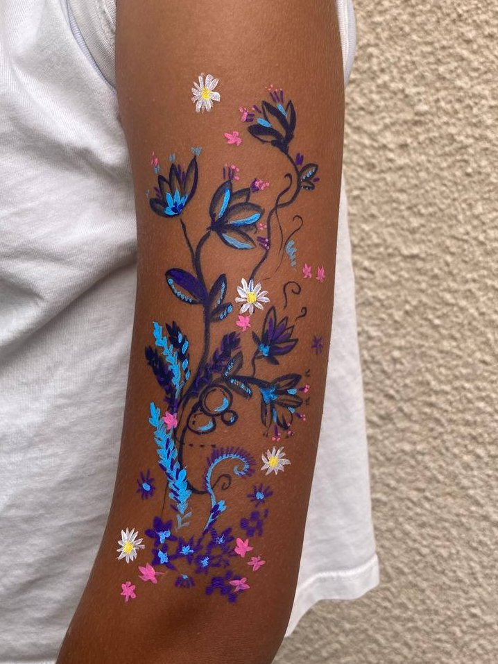
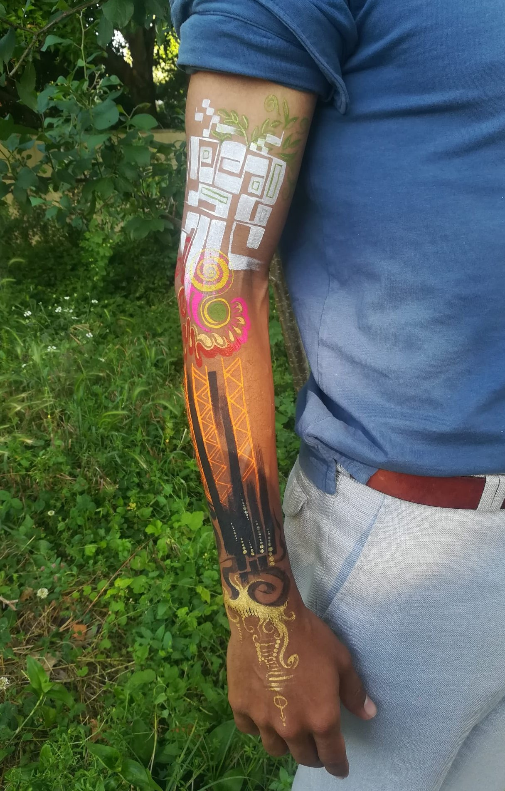

# NAM★

Artiste Bodypainting — Transformer la peau en toile.

---

## Mes interventions

### Séance individuelle

Offrir un espace de bien-être dédié à votre corps et à votre écoute en passant
par de la peinture sur corps. Vous devenez une œuvre vivante éphémère.

**Où ?** À domicile (jusqu'à 1h de Bègles).

**Comment ?** Durée de 30min à 3h, ambiance sur-mesure, peintures véganes.

**Contributions :** Prix libres et conscients (€ ou Ğ1). ~15-20€/h soutient mon activité.

[Me contacter pour réserver](mailto:bodypainting@nam-phuong.fr)

### Séance collective

Ateliers de bodypainting en petit groupe (entre ami·e·s, équipes, ou collectifs,
10 personnes max). Un moment de partage, de jeu et d'expression corporelle
douce.

**Durée :** 1h à 2h selon le groupe.

**Lieu :** Chez vous, en extérieur ou en lieu partenaire.

**Matériel :** Fourni (peintures véganes, pinceaux).

[Demander un devis ou des infos](mailto:bodypainting@nam-phuong.fr)

### Intervention événementielle

Animation bodypainting pour festivals, vernissages, mariages, événements
engagés... Créons ensemble des expériences visuelles et sensorielles.

**Format :** Stand libre ou ateliers participatifs.

**Durée :** Demi-journée, journée complète ou sur plusieurs jours.

**Public :** Tout âge, tout public (adaptation selon contexte).

[Discutons de votre projet](mailto:bodypainting@nam-phuong.fr)

[Voir toutes les interventions →](/interventions)

---

## Agenda

### Festival Tu vas bien ?

📅 **Samedi 11 octobre 2025, 11h-22h**  
📍 MOON Creative Workspace — 45 Rue de la Compagnie du Midi, Bordeaux

Venez découvrir le bodypainting lors d'un atelier collectif dans le cadre doux
et bienveillant d'un festival qui change les regards sur la santé mentale à
travers l'art et la culture.

[Voir le site de l'événement →](https://tuvasbien.info/#accueil)

### Ğmarché

📅 **Samedi 30 août, 10h-15h**  
📍 Eysines, Gironde

Je propose mes peintures éphémères en échange de monnaie libre junes (Ğ1) !

### Soirée JE&X

📅 **Dimanche 22 juin 2025, 15h-22h**  
📍 Paris

Intervenant·e en bodypainting pour décorer les participant·es.

[Voir l'agenda complet →](/agenda)

---

## Portfolio

[Voir le portfolio complet →](/portfolio)

---

**Contact :** [bodypainting@nam-phuong.fr](mailto:bodypainting@nam-phuong.fr) • **Instagram :** [@nam_bodypainting](https://instagram.com/nam_bodypainting)

